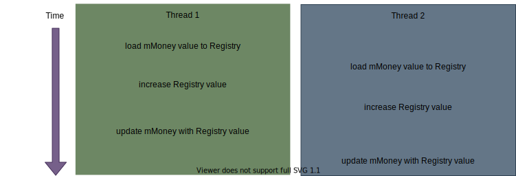
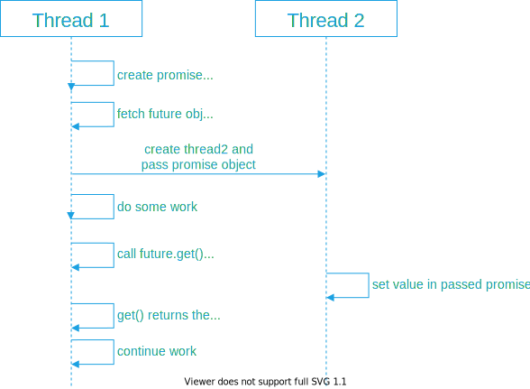

Multithreading is a feature that allows concurrent execution of two or more parts of a program for maximum utilization of the CPU.
Multithreading support was introduced in C+11.


!!! note
    Multiple threads may read from the same memory location while all other accesses (r-w,w-r and w-w) are called conflicts. Data races, deadlocks are undefined behavior.

## Thread

### Launching Thread

The constructor of `std::thread` can be used to start a new thread. We simply need to pass the executing code to be called (i.e, a callable object).
Once the object is created a new thread is launched which will execute the code specified in callable.
A callable can be either of the three

- Function pointer
- Function object
- Lambda expression

```cpp
#include <iostream>
#include <thread>
void foo(int a, int b)
{
  std::cout << "Thread has ID: " << std::this_thread::get_id() << std::endl;
}
class bar
{
  // Overload () operator
  void operator()(int c)
  {
      std::cout << "Thread has ID: " << std::this_thread::get_id() << std::endl;
  }
};
int main()
{
  int a = 1;
  int b = 2;
  // Pass a function and args
  std::thread t1(foo, a, b);
  // Pass a lambda
  std::thread t2([a, b](){ foo(a, b); });
  // Pass a function object
  std::thread t3(bar(), a);
  // Execute in the main thread
  foo(6, 7);
  t3.join();
  t2.join();
  t1.join();
}
```

Thread is movable but not copyable. `std::move` tansfers all resources associated with the running thread. The _move-from_ thread becomes empty and not joinable, and only the _move-to_ thread can be joined.

```cpp
#include <iostream>
#include <string_view>
#include <thread>
void foo(std::string_view s);
int main()
{
  std::thread t1([]() { foo("Hi\n"); });
  std::thread t2 = std::move(t1); // t1 is now empty
  t2.join(); // OK, thread originally started in t1 is joined
}
```

Thread can be used in standard library containers, e.g.

```cpp
#include <thread>
#include <vector>
void foo(int i);
int main()
{
  std::vector<std::thread> threadPool;
  for (int i = 1; i <= 9; ++i)
  {
    threadPool.emplace_back([i]() { foo(i); });
  }
  // Digits 1 to 9 are printed (unordered)
  for (auto& t : threadPool)
  {
    t.join();
  }
}
```

### Join and Detach

The thread will terminate once the function returns.
The member function `join()` can be used to wait for a thread to finish. This function makes the current thread wait until the thread identified by `*this` has finished executing. It must be called exactly once for each thread.

Alternatively, a thread can be detached for the thread object with `detach()`. The thread object can be destroyed and the OS thread of execution can continue on. If the program needs to know when that thread of execution has completed, some other mechanism needs to be used. `join()` cannot be called on that thread object any more, since it is no longer associated with a thread of execution.

`join()` or `detach()` must be called **before** a thread object is destroyed. It is considered an error to destroy a C++ thread object while it is still "joinable". If a C++ thread object is still joinable when it's destroyed, an exception will be thrown.

```cpp
#include <iostream>
#include <string_view>
#include <thread>
void foo(std::string_view s);
int main() {
{
  std::thread t1([]() { foo("Hi\n"); });
  t1.join();
}
// Everything is fine, we called t1.join()
{
  std::thread t2([]() {});
}
// Program terminated because t2 is joinable when destroyed
}
```

Both API can be called only on a joinable thread. It can be checked with `joinable()` before calling `joint()` or `detach()`.

```cpp
std::thread th(foo, args);
if (th.joinable())
{
  th.detach();
}
```

### Manage the Current Thread

| API         | C++ Version | Description                                                                             |
|-------------|-------------|-----------------------------------------------------------------------------------------|
| yield       | C++11       | suggests that the implementation reschedule execution of threads                        |
| get_id      | C++11       | returns the thread id of the current thread (OS specific)                               |
| sleep_for   | C++11       | blocks the execution of the current thread for at least the specified sleep_duration.   |
| sleep_until | C++11       | blocks the execution of the current thread until specified sleep_time has been reached. |

Each thread object has an associated ID `std::thread::id` which can be get by `std::thread::get_id()`. `std::this_thread::get_id()` returns the ID of the current thread. If a thread object has no associated thread, `get_id()` will return "not any thread"

!!! note
    In the example, the arguments are passed by value. If you pass by reference, the life time of the variable has to be considered. The thread kann exceed its lifetime, which leads to access a destroyed object.

### Call_once

In some use cases, we want to executes the Callable object exactly once, even if called concurrently, from several threads.
For instance, you have to do a _not-thread-safe_ one-time global initialization before you're able to do some _thread-safe_ stuff. You can use `call_once` that calls the initialization only once, no matter in which thread and whether it's called concurrently.

```cpp
void init()
{
  std::cout << "Initializing..." << std::endl;
  // Do something
}

void worker(once_flag* flag)
{
  call_once(*flag, init);
}

int main()
{
  once_flag flag;
  std::vector<std::thread> threadPool;
  for (int i = 1; i <= 9; ++i)
  {
    threads.push_back(std::thread(worker, &flag));
  }
  for (auto& t : threadPool)
  {
    t.join();
  }
}
```

In this example, all 9 threads will call `init` once. We don't know which thread has called the init function but it doesn't matter.

## Critical Section and Race Condition

A **critical section** is a section of code that is executed by multiple threads and where the sequence of execution for the threads makes a difference in the result of the concurrent execution of the critical section.

A **race condition** is a situation that may occur inside a critical section. This happens when the result of multiple thread execution in critical section differs according to the order in which the threads execute.
The term race condition stems from the metaphor that the threads are racing through the critical section, and that the result of that race impacts the result of executing the critical section.
Race conditions can be extremely difficult to debug simply because the bug itself depends on the timing of nondeterministic events. It is quite common that the bug cannot be recreated by testers, particularly if the problematic timing results from a rare circumstance.

!!! danger "Story"
    The Therac-25 radiation therapy machine is a classic and well-cited example of a race condition with deadly effects. The software for this machine included a one-byte counter. If the machine’s operator entered terminal input to the machine at the exact moment that the counter overflowed (quite common for a counter with only 256 possible values), a critical safety lock failed. This flaw made it possible for patients to receive approximately 100 times the intended radiation dose, which directly caused the deaths of three patients. [^1]

Let's try the following example. Five threads are launched to add 1000 respectively to a shared account object. The initial amount is 0 and the expected amount is 5000 when all the threads are finished.

```cpp
#include <iostream>
#include <vector>
#include <thread>

class Account
{
public:
  Account() : mMoney(0) {}
  int getMoney()
  {
    return mMoney;
  }
  void addMoney(int money)
  {
    for (auto i = 0; i < money; i++) {
      mMoney++;
    }
  }

private:
  int mMoney;
};

int testMultiThreadAccount()
{
  Account myAccountObj;
  std::vector<std::thread> threadpool;
  // 5 thread to add 1000 to myAccountobj in each.
  for (auto i = 0; i < 5; i++) {
    threadpool.push_back(std::thread(&Account::addMoney, &myAccountObj, 1000));
  }
  for (auto& t : threadpool) {
    t.join();
  }
  return myAccountObj.getMoney();
}

int main()
{
  int value;
  for (int i = 0; i < 1000; i++) {
    value = testMultiThreadAccount();
    if (value != 5000) {
      std::cout << "Error at run = " << i << ", Money in accout = " << value << std::endl;
    }
  }
  return 0;
}
```

The result is sometimes less than the expectation due to race condition.

```plain
Error at run = 302, Money in accout = 4651
Error at run = 540, Money in accout = 4985
Error at run = 625, Money in accout = 4000
Error at run = 662, Money in accout = 4000
Error at run = 809, Money in accout = 4379
Error at run = 816, Money in accout = 4993
Error at run = 821, Money in accout = 4879
Error at run = 837, Money in accout = 2000
Error at run = 875, Money in accout = 4823
Error at run = 881, Money in accout = 4701
Error at run = 911, Money in accout = 4118
Error at run = 949, Money in accout = 4000
```

As we know, for modern processors, in order to speed up processing, each processor has multi-level Cache as shown in the following figure.
The cache is involved when the processor is performing calculations, such as reading and writing data. It is possible that there is an inconsistency between the cache and the main memory of the system. That is, a result is computed and saved in the processor's cache, but not yet synchronized to the main memory, and this value is not visible to other processors.


<!-- <p align="center" width="100%">
    
</p> -->

Actually, the statement `mMoney++` is not atomic. It is actually a combination of many instructions to accomplish. Let's say that on a particular device, this statement is accomplished by 3 machine commands and their timing may be as follows:


<!-- <p align="center" width="100%">
    
</p> -->

In this case, an increment will be ignored, because instead of increasing the mMoney variable twice, a different register is added and the value of the "mMoney" variable is overwritten.

Naturally, we can now understand that the race condition occurs because these threads are accessing the shared data at the same time, and the changes made by some of them are not made known to the other threads, causing the other threads to process on the wrong basis, and the result is naturally wrong.
Avoiding race conditions requires data protection for critical sections.
If we let only one thread access the shared data at a time, and let other threads access it afterwards, the problem can be solved.

## Mutex and Lock

### Mutual Exclusion

Mutual exclusion is a straightforward way to synchronize multiple threads, thus, avoid race conditions.

- Threads acquire a lock on a mutex object before entering a critical section.
- Threads release their lock on the mutex when leaving a critical section.

In the c++, mutexes are in the `<mutex>` header file, and there are mainly 6 classes:

| API                   | C++ version| Description                                          |
| --------------------- | ---------- | ---------------------------------------------------- |
| mutex                 | C++11      | basic mutual exclusion                               |
| timed_mutex           | C++11      | with timeout                                         |
| recursive_mutex       | C++11      | can be recursively locked by the same thread         |
| recursive_timed_mutex | C++11      | recursive mutex with timeout                         |
| shared_timed_mutex    | C++14      | shared mutex with timeout                            |
| shared_mutex          | C++17      | several threads can share ownership of the same mutex|

All mutex classes have three basic member functions:

|lock|locks the mutex, blocks if the mutex is not available|
|try_lock|tries to lock the mutex, returns if the mutex is not available|
|unlock|unlocks the mutex|

Other classes are extended with following features:

- **timeout** provides `try_lock_for` and `try_lock_until` methods. If the lock is not acquired within the time limit, it will return directly and will not wait any longer.
- **recursive** The same lock can be locked multiple times in the same thread. This avoids some unnecessary deadlocks.
- **share** has two levels of access. `shared`: several threads can share ownership of the same mutex. `exclusive`: only one thread can own the mutex.
  - If one thread has acquired the exclusive lock (through `lock`, `try_lock`), no other threads can acquire the lock (including the shared).
  - If one thread has acquired the shared lock (through `lock_shared`, `try_lock_shared`), no other thread can acquire the exclusive lock, but can acquire the shared lock.

In practice, high-level programming model is designed like this:

- The resource (usually a class) that requires protection from data races owns a mutex object of the appropriate type.
- Threads that intend to access the resource acquire a suitable lock on the mutex **before** performing the actual access.
- Threads release their lock on the mutex **after** completing the access.
- Usually locks are simply acquired and released in the member functions of the class.

Next, let's fix the example code with mutex. We have only to modify the `Account` class and lock in the shared function `addMoney`:

```cpp
class Account
{
public:
  Account() : mMoney(0) {}
  int getMoney()
  {
    return mMoney;
  }
  void addMoney(int money)
  {
    exclusive.lock();
    for (auto i = 0; i < money; i++) {
      mMoney++;
    }
    exclusive.unlock();
  }

private:
  int mMoney;
  std::mutex exclusive;
};
```

In the example, we have manually locked and unlocked the mutex. This is not an easy task in a complicated nested structure considering exception.
What happens if we forget to release the lock at the end of the function? In this case, one thread will exit without releasing the lock and the other threads will remain waiting. To avoid this, we should use `std::lock_guard`.

The class lock_guard is a mutex wrapper that provides a convenient RAII-style mechanism for owning a mutex for the duration of a scoped block.
When a lock_guard object is created, it attempts to take ownership of the mutex it is given. When control leaves the scope in which the lock_guard object was created, the lock_guard is destructed and the mutex is released.

```cpp
class Account
{
public:
  Account() : mMoney(0) {}
  int getMoney()
  {
    return mMoney;
  }
  void addMoney(int money)
  {
        std::lock_guard<std::mutex> lockGuard(exclusive);
    for (auto i = 0; i < money; i++) {
      // In case of exception, destructor of lock_guard will be called
      mMoney++;
    }
    // destructor of lock_guard will be called to unlock mutex
  }

private:
  int mMoney;
  std::mutex exclusive;
};
```

If you compared the example using 5 threads with a serial version, it performs much worse than the single thread program.

!!! note "WHY?"
    It is costly to add and unlock locks. The most time-consuming part of the computation here is inside the lock, which can only be executed by one thread at a time serially, compared to the single-threaded model, the example is not only serial, but also increases the burden of lock, and thus slower.

The data we divide to each thread is actually independent and time consuming for data processing, but in fact this part of the logic can be handled separately by each thread and there is no need to add locks. Only one lock at the end when aggregating the data will be sufficient.
To improve the performance, we modify the member function as

```cpp
void addMoney(int money)
{
  int tmp =0;
  for (auto i = 0; i < money; i++) {
    tmp++;
  }
  std::lock_guard<std::mutex> lockGuard(exclusive);
  mMoney += tmp;
}
```

The for-loop is parallalized and the example outperforms the single thread version.
We describe the scope of a lock in terms of its granularity. Fine-grained means that the lock protects a small range, and coarse-grained means that the lock protects a large range. For performance reasons, we should ensure that the lock is as fine-grained as possible. Also, time-consuming operations, such as IO, should not be performed within the scope of the lock, and if the computation is time-consuming, it should be moved outside the lock as much as possible.

!!! quote
    In general, a lock should be held for only the minimum possible time needed to perform the required operations.
    –《C++ Concurrency in Action》

### RAII Wrappers

Besides `lock_guard`, the standard library provides RAII wrappers for locking and unlocking mutexes

| API         | C++ version| Description                                               |
| ----------  | ---------- | --------------------------------------------------------- |
| lock_guard  | C++11      | implements a strictly scope-based mutex ownership wrapper |
| unique_lock | C++11      | implements movable mutex ownership wrapper                |
| shared_lock | C++11      | implements movable shared mutex ownership wrapper         |
| scoped_lock | C++11      | deadlock-avoiding RAII wrapper for multiple mutexes       |

!!! tip
    The RAII wrappers should always be preferred for locking and unlocking mutexes, since it makes bugs due to inconsistent locking/unlocking much more unlikely.

The full name of RAII is _Resource Acquisition Is Initialization_.
RAII is a C++ programming technique that ties the life cycle of resources that must be requested before they can be used (e.g., allocated heap memory, threads of execution, open sockets, open files, locked mutexes, disk space, database connections, etc.) to the life cycle of an object. RAII ensures that resources are available to any function that will access the object. It also ensures that all resources are released in reverse order of acquisition at the end of the lifetime of the object they control. Similarly, if the resource acquisition fails (the constructor exits with an exception), all resources acquired for the constructed object and base class subobjects are released in reverse order of initialization. This effectively eliminate memory leaks and ensure exception safety.

<!-- !!! summary "RAII"
    - Wrapping each resource into a class
      - where the constructor requests the resource and establishes all class invariants or throws an exception if it fails to complete, and the destructor releases the resource and never throws an exception.
      - The destructor releases resources and never throws an exception.
    - Always use a resource via an instance of the RAII class that
      - has its own automatic storage period or temporary lifetime, or
      - has a lifetime bound to the lifetime of an automatic or temporary object -->

#### Unique_lock

`std::unique_lock` provides additional constructors

- unique_lock(mutex_type& m, std::defer_lock_t t) – Do not immediately lock the mutex
- unique_lock(mutex_type& m, std::try_to_lock_t t) – Do not block when the mutex cannot be locked

std::unique_lock provides additional member functions

- lock() – Manually lock the mutex
- try_lock() – Try to lock the mutex, return true if successful
- operator bool() – Check if the std::unique_lock holds a lock on the mutex

```cpp
#include <mutex>
std::mutex mutex;
void foo()
{
  std::unique_lock lock(mutex, std::try_to_lock);
  if (!lock)
  {
    // do unsynchronized work here

    lock.lock(); // block until we can get the lock
  }

  // do synchronized work here;

  lock.unlock(); // release the lock early

  // do unsynchronized work here
}
```

The difference between `lock_guard` and `unique_lock` is that you can lock and unlock a `std::unique_lock`. `std::lock_guard` will be locked only once on construction and unlocked on destruction. `unique_lock` also provides the feature e.g., be constructed without locking the mutex immediately. `lock_guard` cannot lock multiple mutexes safely.
!!! note
    Since C++17, one should use `std::scoped_lock` instead of `std::lock_guard`.

#### Shared_lock

std::shared_lock can be used to lock a mutex in shared mode

- Constructors and member functions analogous to std::unique_lock
- Multiple threads can acquire a shared lock on the same mutex
- Shared locking attempts block if the mutex is locked in exclusive mode
- Only usable in conjunction with std::shared_mutex

!!! note
    Shared mutexes are mostly used to implement read/write-locks. Only read accesses are allowed when holding a shared lock while write accesses are only allowed when holding an exclusive lock.

```cpp
#include <shared_mutex>
class SafeCounter
{
private:
  mutable std::shared_mutex mutex;
  size_t value = 0;
  public:
  size_t getValue() const
  {
    std::shared_lock lock(mutex);
    return value; // read access
  }

  void incrementValue()
  {
    std::unique_lock lock(mutex);
    ++value; // write access
  }
};
```

#### Scoped_lock

`Scoped_lock` locks a mutex for its lifetime and unlocks it when it is destroyed. Also, it can lock multiple mutexes and avoid deadlocks.

```cpp
#include <chrono>
#include <functional>
#include <iostream>
#include <mutex>
#include <string>
#include <thread>
#include <vector>
using namespace std::chrono_literals;

struct Employee
{
  std::vector<std::string> lunch_partners;
  std::string id;
  std::mutex m;
  Employee(std::string id) : id(id) {}
  std::string partners() const
  {
    std::string ret = "Employee " + id + " has lunch partners: ";
    for (const auto& partner : lunch_partners)
      ret += partner + " ";
    return ret;
  }
};

void send_mail(Employee &, Employee &)
{
  // simulate a time-consuming messaging operation
  std::this_thread::sleep_for(1s);
}

void assign_lunch_partner(Employee &e1, Employee &e2)
{
  static std::mutex io_mutex;
  {
    std::lock_guard<std::mutex> lk(io_mutex);
    std::cout << e1.id << " and " << e2.id << " are waiting for locks" << std::endl;
  }

  {
    // use std::scoped_lock to acquire two locks without worrying about
    // other calls to assign_lunch_partner deadlocking us
    // and it also provides a convenient RAII-style mechanism

    std::scoped_lock lock(e1.m, e2.m);

    // Equivalent code 1 (using std::lock and std::lock_guard)
    // std::lock(e1.m, e2.m);
    // std::lock_guard<std::mutex> lk1(e1.m, std::adopt_lock);
    // std::lock_guard<std::mutex> lk2(e2.m, std::adopt_lock);

    // Equivalent code 2 (if unique_locks are needed, e.g. for condition variables)
    // std::unique_lock<std::mutex> lk1(e1.m, std::defer_lock);
    // std::unique_lock<std::mutex> lk2(e2.m, std::defer_lock);
    // std::lock(lk1, lk2);
    {
        std::lock_guard<std::mutex> lk(io_mutex);
        std::cout << e1.id << " and " << e2.id << " got locks" << std::endl;
    }
    e1.lunch_partners.push_back(e2.id);
    e2.lunch_partners.push_back(e1.id);
  }

  send_mail(e1, e2);
  send_mail(e2, e1);
}

int main()
{
  Employee alice("Alice"), bob("Bob"), christina("Christina"), dave("Dave");

  // assign in parallel threads because mailing users about lunch assignments
  // takes a long time
  std::vector<std::thread> threads;
  threads.emplace_back(assign_lunch_partner, std::ref(alice), std::ref(bob));
  threads.emplace_back(assign_lunch_partner, std::ref(christina), std::ref(bob));
  threads.emplace_back(assign_lunch_partner, std::ref(christina), std::ref(alice));
  threads.emplace_back(assign_lunch_partner, std::ref(dave), std::ref(bob));

  for (auto &thread : threads)
      thread.join();
  std::cout << alice.partners() << '\n'  << bob.partners() << '\n'
            << christina.partners() << '\n' << dave.partners() << '\n';
}
```

### Deadlocks

The following example will lead to deadlocks：

```cpp
std::mutex m1, m2, m3;
void threadA()
{
  // INTENTIONALLY BUGGY
  std::unique_lock l1{m1}, l2{m2}, l3{m3};
}
void threadB()
{
  // INTENTIONALLY BUGGY
  std::unique_lock l3{m3}, l2{m2}, l1{m1};
}
```

Possible deadlock scenario:

- threadA() acquires locks on m1 and m2
- threadB() acquires lock on m3
- threadA() waits for threadB() to release m3
- threadB() waits for threadA() to release m2

`std::scoped_lock` RAII wrapper can be used to safely lock any number of mutexes:

```cpp
std::mutex m1, m2, m3;
void threadA()
{
  // OK, will not deadlock
  std::scoped_lock l{m1, m2, m3};
}
void threadB()
{
  // OK, will not deadlock
  std::scoped_lock l{m3, m2, m1};
}
```

### Condition Variables

A condition variable is a synchronization primitive that allows multiple threads to wait until an (arbitrary) condition becomes true.

- A condition variable uses a mutex to synchronize threads
- Threads can wait on or notify the condition variable
- When a thread waits on the condition variable, it blocks until another thread notifies it
- If a thread waited on the condition variable and is notified, it holds the mutex
- A notified thread must check the condition explicitly because spurious wake-ups can occur

Class `std::condition_variable` in the header `<condition_variable>` has the following member functions:

- **wait()**: Takes a reference to a std::unique_lock that must be locked by the caller as an argument, unlocks the mutex and waits for the condition
variable
- **notify_one()**: Notify a single waiting thread, mutex does not need to be held by the caller
- **notify_all()**: Notify all waiting threads, mutex does not need to be held by the caller

```cpp
#include <iostream>
#include <string>
#include <thread>
#include <mutex>
#include <condition_variable>

std::mutex m;
std::condition_variable cv;
std::string data;
bool ready = false;
bool processed = false;

void worker_thread()
{
    // Wait until main() sends data
    std::unique_lock lk(m);
    cv.wait(lk, []{return ready;});

    // after the wait, we own the lock.
    std::cout << "Worker thread is processing data" << std::endl;
    data += " after processing";

    // Send data back to main()
    processed = true;
    std::cout << "Worker thread signals data processing completed" << std::endl;

    // Manual unlocking is done before notifying, to avoid waking up
    // the waiting thread only to block again (see notify_one for details)
    lk.unlock();
    cv.notify_one();
}

int main()
{
  std::thread worker(worker_thread);

  data = "Example data";
  // send data to the worker thread
  {
    std::lock_guard lk(m);
    ready = true;
    std::cout << "main() signals data ready for processing" << std::endl;
  }
  cv.notify_one();

  // wait for the worker
  {
    std::unique_lock lk(m);
    cv.wait(lk, []{return processed;});
  }
  std::cout << "Back in main(), data = " << data << std::endl;

  worker.join();
}
```

Output:

```plain
main() signals data ready for processing
Worker thread is processing data
Worker thread signals data processing completed
Back in main(), data = Example data after processing
```

## Future

The standard library provides facilities to obtain values that are returned and to catch exceptions that are thrown by asynchronous tasks (i.e. functions launched in separate threads). These values are communicated in a shared state, in which the asynchronous task may write its return value or store an exception, and which may be examined, waited for, and otherwise manipulated by other threads that hold instances of std::future or std::shared_future that reference that shared state.

| API           | C++ version| Description                                                                                         |
| ------------- | ---------- | --------------------------------------------------------------------------------------------------- |
| async         | C++11      | Run a function asynchronously and return a std::future with its result                              |
| future        | C++11      | waits for a value that is set asynchronously                                                        |
| packaged_task | C++11      | packages a function to store its return value for asynchronous retrieval                            |
| promise       | C++11      | stores a value for asynchronous retrieval                                                           |
| shared_future | C++11      | similar to std::future, except that multiple threads are allowed to wait for the same shared state. |

### promise and future

!!! question
    We often encounter situations where we need to get the result returned by a thread, how we can implement it?

#### Share with Pointer

We can pass a pointer to a new thread in which the result will be set. The main thread will wait via condition variables. The new thread then sets the result and notifies the condition variable, the main thread will get the result from that pointer.
To implement this simple feature, we use a condition variable, a mutex lock, and a pointer to capture the return value.

If we want the thread to return multiple different values at different points in time, the problem becomes more complex. Is there an easy way to get the return value from the thread?  
The answer is to use std::future

#### C++11 `promise` and `future`

`std::future` is a class template whose objects store future values.
In fact, a `std::future` object stores internally a value that will be assigned in the future, and provides a mechanism to access that value, implemented through the member function `get()`. But if someone tries to access the value through it before the `get()` function is available, then the it will block until that value is available.
`std::promise` provides a facility to store a value or an exception that is later acquired asynchronously via a `std::future` object created by the `std::promise` object.

Each `std::promise` object has a corresponding `std::future` object, through which others can get the value set by the `promise`.
For instance,

1. thread 1 creates a `std::promise` object and then get the `std::future` object from it.
2. thread 1 passes it to thread 2.
3. Thread 1 will get the value set by thread 2 through the `get()` of `std::future`.
4. If thread 2 has not yet set the value, the `get()` call will block until thread 2 sets the value in the `promise` object.



Here is a complete example of `std::future` and `std::promise`.

```cpp
#include <iostream>
#include <thread>
#include <future>
#include <chrono>

void doWork(std::promise<int> promiseObj)
{
  std::cout << "Inside new thread" << std::endl;
  std::this_thread::sleep_for(std::chrono::seconds(5));
  promiseObj.set_value(7);  // set value that can be accessed by future1
}

int main()
{
  std::promise<int> promise1;
  std::future<int> future1 = promise1.get_future();
  std::thread th(doWork, std::move(promise1));
  std::cout << "Main thread call get() for result... " << std::endl;
  int result = future1.get();  // blocked here until promise1 is set in the new thread
  std::cout << "Result is returned: " << result << std::endl;
  th.join();
  return 0;
}
```

### async

The function template `async` runs a function asynchronously (potentially in a separate thread which might be a part of a thread pool) and returns a `std::future` that will eventually hold the result of that function call.

The first parameter in `std::async` is the launch policy, which controls the asynchronous behavior.

|Bit|Description|
|---|---|
|std::launch::async|enable asynchronous evaluation (separate thread)|
|std::launch::deferred|enable lazy evaluation|
|std::launch::async \| std::launch::deferred|asynchronously or not, depending on the system load (default)|

 If more than one flag is set, it is implementation-defined which policy is selected. For the default (both the std::launch::async and std::launch::deferred flags are set in policy), standard recommends (but doesn't require) utilizing available concurrency, and deferring any additional tasks.

```cpp
#include <iostream>
#include <cmath>
#include <thread>
#include <future>

class Worker
{
public:
  Worker(int min, int max) : mMin(min), mMax(max) {}  // ①
  double work()
  {  //
    mResult = 0;
    for (int i = mMin; i <= mMax; i++) {
      mResult += std::sqrt(i);
    }
    return mResult;
  }
  double getResult()
  {
    return mResult;
  }

private:
  int mMin;
  int mMax;
  double mResult;
};

int main()
{
  Worker w(0, 10e8);
  std::cout << "Task in class triggered" << std::endl;
  auto f3 = std::async(std::launch::async, &Worker::work, &w);  //
  f3.wait();
  std::cout << "Task in class finish, result: " << w.getResult() << std::endl << std::endl;

  return 0;
}
```

!!! attention
    Note that a pointer to the object `&w` is passed. If you do not write `&` a temporary copy of the object `w` will be passed in.

### packaged_task

The class template `std::packaged_task` wraps any Callable target (function, lambda expression, bind expression, or another function object) so that it can be invoked asynchronously. Its return value or exception thrown is stored in a shared state which can be accessed through `std::future` objects.

```cpp
#include <iostream>
#include <cmath>
#include <thread>
#include <future>
#include <functional>

// unique function to avoid disambiguating the std::pow overload set
int f(int x, int y) { return std::pow(x,y); }

void task_lambda()
{
  std::packaged_task<int(int,int)> task([](int a, int b) {
      return std::pow(a, b);
  });
  std::future<int> result = task.get_future();

  task(2, 9);

  std::cout << "task_lambda:\t" << result.get() << '\n';
}

void task_bind()
{
  std::packaged_task<int()> task(std::bind(f, 2, 11));
  std::future<int> result = task.get_future();

  task();

  std::cout << "task_bind:\t" << result.get() << '\n';
}

void task_thread()
{
  std::packaged_task<int(int,int)> task(f);
  std::future<int> result = task.get_future();

  std::thread task_td(std::move(task), 2, 10);
  task_td.join();

  std::cout << "task_thread:\t" << result.get() << '\n';
}

int main()
{
  task_lambda();
  task_bind();
  task_thread();
}
```

```cpp
#include <iostream>
#include <cmath>
#include <thread>
#include <future>
#include <vector>

using namespace std;

static const int MAX = 10e8;

double concurrent_worker(int min, int max)
{
  double sum = 0;
  for (int i = min; i <= max; i++) {
    sum += sqrt(i);
  }
  return sum;
}

double concurrent_task(int min, int max)
{
  vector<future<double>> results;  // future list to store results

  unsigned concurrent_count = thread::hardware_concurrency();
  min = 0;
  for (int i = 0; i < concurrent_count; i++) {
    packaged_task<double(int, int)> task(concurrent_worker);  // package task
    results.push_back(task.get_future());                     // store associated future objects

    int range = max / concurrent_count * (i + 1);
    thread t(std::move(task), min, range);  // launch new thread
    t.detach();

    min = range + 1;
  }

  cout << "threads create finish" << endl;
  double sum = 0;
  for (auto& r : results) {
    sum += r.get();  // add results up
  }
  return sum;
}

int main()
{
  auto start_time = chrono::steady_clock::now();
  double r = concurrent_task(0, MAX);
  auto end_time = chrono::steady_clock::now();
  auto ms = chrono::duration_cast<chrono::milliseconds>(end_time - start_time).count();
  cout << "Concurrent task finish, " << ms << " ms consumed, Result: " << r << endl;
  return 0;
}
```

In real projects, you can package tasks into queues with the help of `packaged_task` and then schedule them by means of thread pools.


A `packaged_task` won't start on it's own, you have to invoke it. On the other hand, `std::async` with `launch::async` will try to run the task in a different thread.
By using `std::async` you cannot run your task on a specific thread anymore, where `std::packaged_task` can be moved to other threads.

In the end a `std::packaged_task` is just a lower level feature for implementing `std::async` (which is why it can do more than `std::async` if used together with other lower level stuff, like `std::thread`). Simply spoken a `std::packaged_task` is a `std::function` linked to a `std::future` and `std::async` wraps and calls a `std::packaged_task` (possibly in a different thread).

!!! tldr
    Use `std::async` if you want some things done and don't really care when they're done, and `std::packaged_task` if you want to wrap up things in order to move them to other threads or call them later.

## Parallel STL

With C++17, most of the algorithms of the Standard Template Library will be available in a parallel version. Therefore, you can invoke an algorithm with a so-called execution policy. This execution policy specifies if the algorithm runs sequential (`std::seq`), parallel (`std::par`), or parallel and vectorised (`std::par_unseq`).

```cpp
std::vector<int> vec ={3, 2, 1, 4, 5, 6, 10, 8, 9, 4};

std::sort(vec.begin(), vec.end());                            // sequential as ever
std::sort(std::execution::seq, vec.begin(), vec.end());       // sequential
std::sort(std::execution::par, vec.begin(), vec.end());       // parallel
std::sort(std::execution::par_unseq, vec.begin(), vec.end()); // parallel and vectorized
```

Therefore, the first and second variations of the sort algorithm run sequential, the third parallel, and the fourth parallel and vectorised.

C++20 offers totally new multithreading concepts. The key idea is that multithreading becomes a lot simpler and less error-prone.

[^1]: https://en.wikipedia.org/wiki/Therac-25
