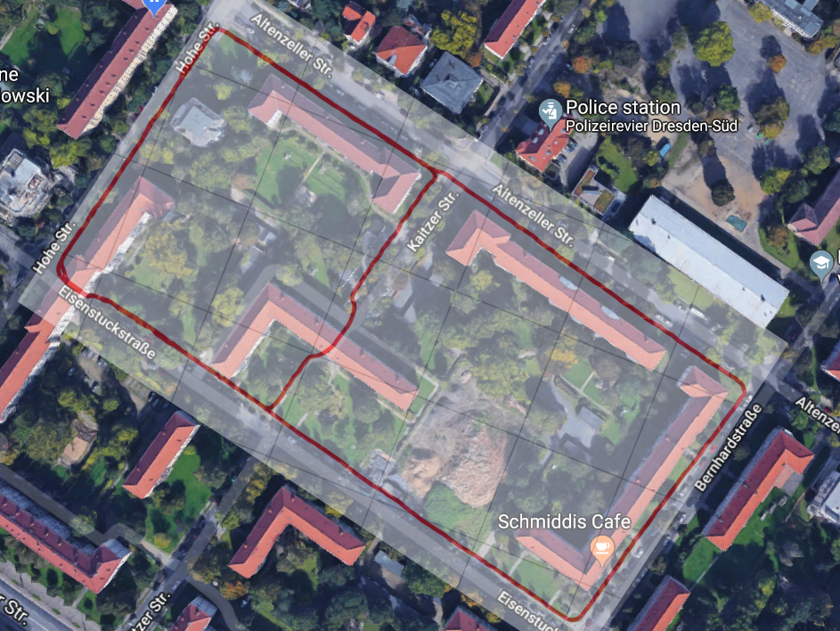

# FLYing maniPULATOR

## Summary

Conceptual and technology development for aerial manipulation with free fyling fully actuated multicopters.

## Description

Aim of the Flypulator project is the development of flight robots for manipulation of stationary objects. Possible application scenarios include cleaning tasks and vegetation trimming in hardly accessible places. The development is focused on fully actuated flight robots. Due to their high agility, they allow the use of lightweight manipulators with small degree of freedom. The most important fields of activity are the construction of the hardware, the development and implementation of the control system and a detailed modelling including aerodynamical simulations and experiments.[^1]

One of the lastest results was presented by Shuster et al. at IROS 2022 (see the [video](https://www.youtube.com/watch?v=jGJbtuPdbJg)).

<!--  -->

## Contributions

- Tilt-Hexarotor prototype
- Motion tracking system based on VIVE Tracker.
- Kinematic and dynamic models for the Tilt-Hexarotor
- Nonlinear controllability and control authority for the semi-fully-actuated aerial vehicle.
- Simulation framework in Simulink and Gazebo.
- controllers (feedback linearization, SMC, backstepping, etc.) and observers (KF, EKF) design and implemented in Matlab and ROS
- Visual inertial odometer (Stereo extension of [VINS-Mono](https://github.com/HKUST-Aerial-Robotics/VINS-Mono))

<figure markdown>
  { width="500" }
  <figcaption>Design of the aerial manipulator</figcaption>
</figure>

Video: Omnidirectional UAV Demo
<iframe src="https://drive.google.com/file/d/1jubGSoYha0RpJtPnXp44NTNckSLW4fiN/preview" width="720" height="400" title="Omnidirectional UAV Demo" frameborder="0" allowfullscreen="allowfullscreen"></iframe>

Video: Aerial Manipulator Flying Demo
<iframe src="https://drive.google.com/file/d/1wuZM_G9ex7ERqDk3bxzq64dWEfMcrA1C/preview" width="720" height="400" title="Aerial Manipulator Flying Demo" frameborder="0" allowfullscreen="allowfullscreen"></iframe>

<!-- <figure markdown>
  { width="500" }
</figure>
<figure markdown>
  { width="500" }
  <figcaption>Outdoor demo of VINS-Stereo</figcaption>
</figure> -->

Video: VINS-Stereo Test in Campus Building BAR
<iframe src="https://www.youtube.com/embed/N9uGDChic7w?si=BGB4UXbFhqRzp1GO" width="720" height="400" title="VINS-Stereo BAR test" frameborder="0" allowfullscreen></iframe>

Video: VINS-Stereo Outdoor Test
<iframe src="https://www.youtube.com/embed/XW3dV7o6F24?si=BUWttyHJnmWm1Osc" width="720" height="400" title="VINS-Stereo outdoor test" frameborder="0" allowfullscreen></iframe>

Prototype with fixed rotors: [IROS video](https://www.youtube.com/watch?v=jGJbtuPdbJg)

[^1]: https://tu-dresden.de/ing/maschinenwesen/ifkm/dmt/forschung/projekte/Flypulator
