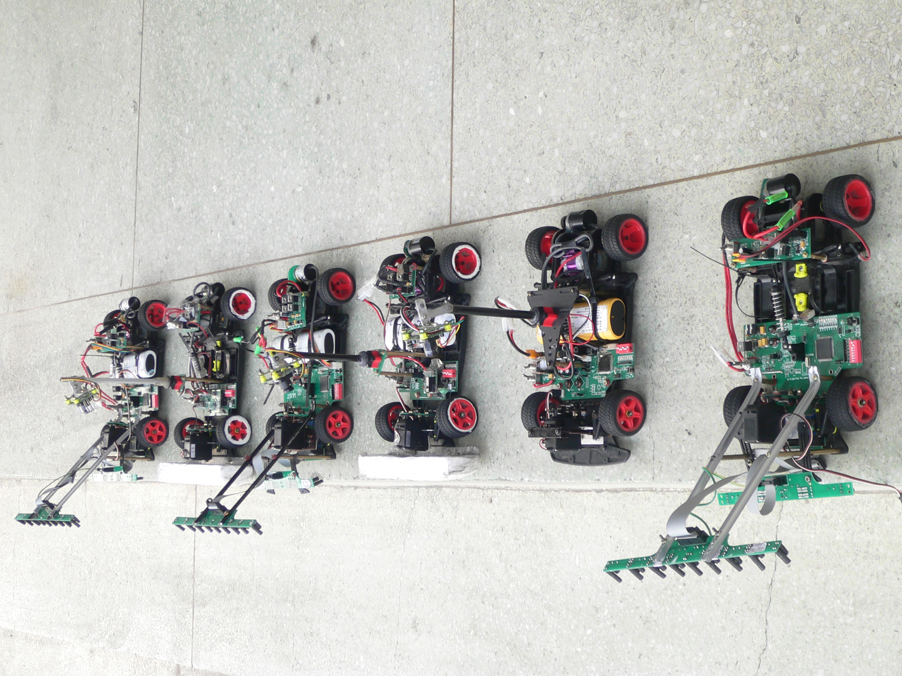
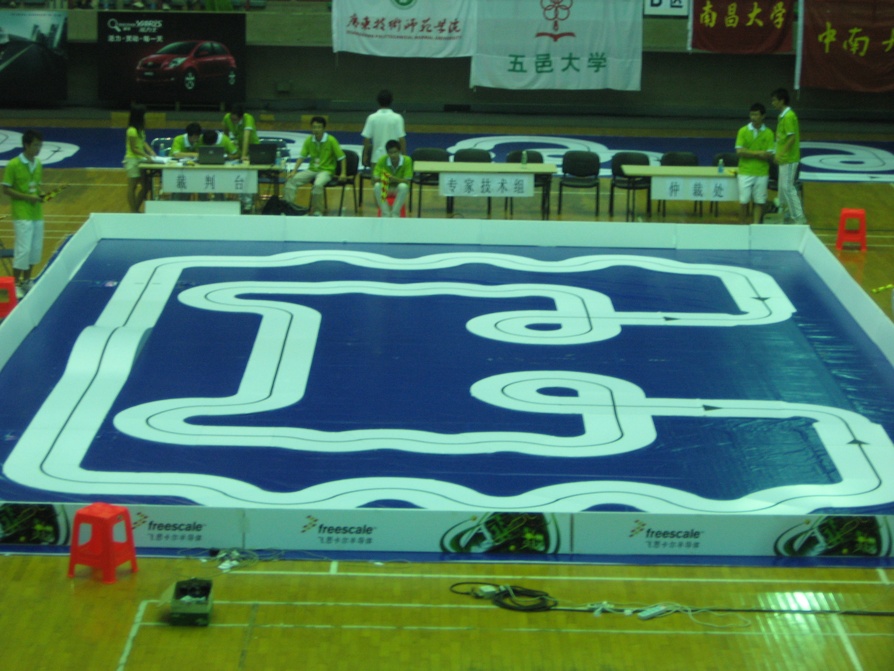

# National University Students Intelligent Car Race

## Desciption

In order to strengthen the cultivation of practical, innovative ability and team spirit of college students and promote the teaching reform of higher education, the National University Students Intelligent Car Race is organized by the Committee of Automation Teaching of the Ministry of Education. This competition is a creative science and technology competition with intelligent vehicles as the research object.

The competition process includes theoretical design, actual production, vehicle debugging and on-site competition, which requires students to form a team and work together to experience the whole process of an engineering research and development project from design to realization.

Since 2008, the competition has been approved by the Ministry of Education as one of the science and technology humanities competitions in the National Teaching Quality and Teaching Reform Project, and in 2009, the fourth edition was invited to apply for inclusion in the National Teaching Quality and Teaching Reform Project.
In principle, the National Students Intelligent Car Race is entered by higher education institutions with automation majors nationwide. The competition is firstly registered and preliminarily held in each sub-region, and the winning teams of each sub-region will participate in the national finals. According to the teams and players of each competition, there are several competition groups such as photoelectric group, camera group, electromagnetic group, etc.

In the competition Freescale's 8-bit and 16-bit microcontrollers are used as the core control unit on the specified model car platform with the aim to identify the road independently with sensors, motor drive circuits and the corresponding software, and to travel according to the specified route. The winner is the one with the shortest running time. The competition thus covers a wide range of disciplines such as control, pattern recognition, perception, electronics, electricity, computer science, and mechanics.

## Contributions

- Design of MCU board, motor drive board and sensor carring board
- Selection of sensors
- Mechanic construction
- Sensor drivers
- Controller design and tuning

<figure markdown>
  { width="500" }
  <figcaption>Intelligent cars built by 4 teams at WUST</figcaption>
</figure>

<figure markdown>
  { width="500" }
  <figcaption>Arena of the national final</figcaption>
</figure>

<figure markdown>
  { width="500" }
</figure>
